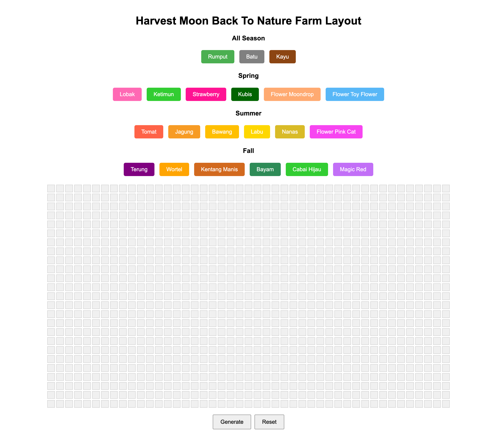

# Farm Layout Application



This repository contains a web-based farm layout application that allows users to design and manage a grid-based farm layout. Users can assign specific items to grid slots and export the layout as a text file.

---

## Features
- Interactive grid layout with selectable slots.
- Assign items to slots based on categories (e.g., All Season, Spring, Summer, Fall).
- Unique colors for each item for easy identification.
- Export layout data as a structured text file.
- Reset grid layout to its initial state.

---

## Prerequisites

Make sure you have the following installed on your system:

- Node.js (v14 or later)
- npm (Node Package Manager)

---

## Getting Started

### 1. Clone the Repository
```bash
git clone <repository-url>
cd <repository-directory>
```

### 2. Install Dependencies
Run the following command to install all required dependencies:
```bash
npm install
```

### 3. Start the Application
Start the development server by running:
```bash
npm run start
```

The application will be available at the following addresses (depending on your network configuration):

```
Available on:
  http://127.0.0.1:8080
  http://192.168.1.13:8080
  http://192.168.100.58:8080
```

---

## Usage Instructions

1. Open the application in your browser using one of the available addresses listed above.
2. Select an item from the options listed under the respective categories:
   - **All Season**
   - **Spring**
   - **Summer**
   - **Fall**
3. Click on a grid slot to assign the selected item to that slot.
4. To unassign an item from a slot, click the slot again.
5. Use the buttons at the bottom of the page:
   - **Generate & Download**: Export the current layout as a text file.
   - **Reset All**: Clear all slots and reset the layout.

---

## Project Structure
```
.
├── public
│   ├── index.html    # Main HTML file
│   ├── styles.css    # CSS styles
│   └── scripts.js    # JavaScript logic
├── package.json      # Project configuration and dependencies
├── README.md         # Project documentation
└── .gitignore        # Git ignore rules
```

---

## Development Notes

- Ensure that Node.js is properly installed before running the application.
- The application is served using a lightweight development server included in the dependencies.

---

## Contribution

Feel free to fork this repository and submit pull requests. For major changes, please open an issue first to discuss your proposed changes.

---

## License
This project is licensed under the MIT License.

